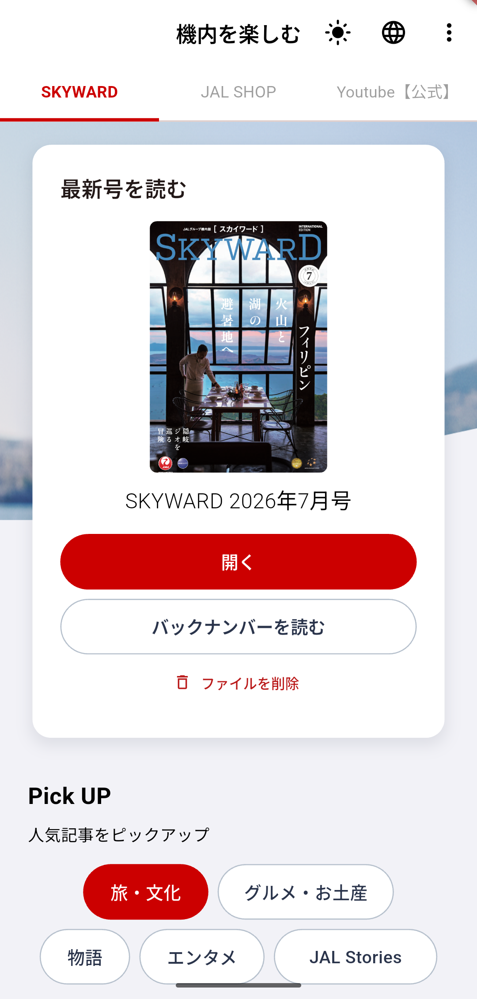
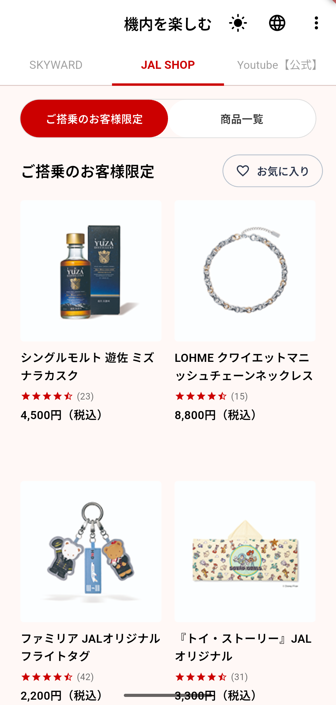
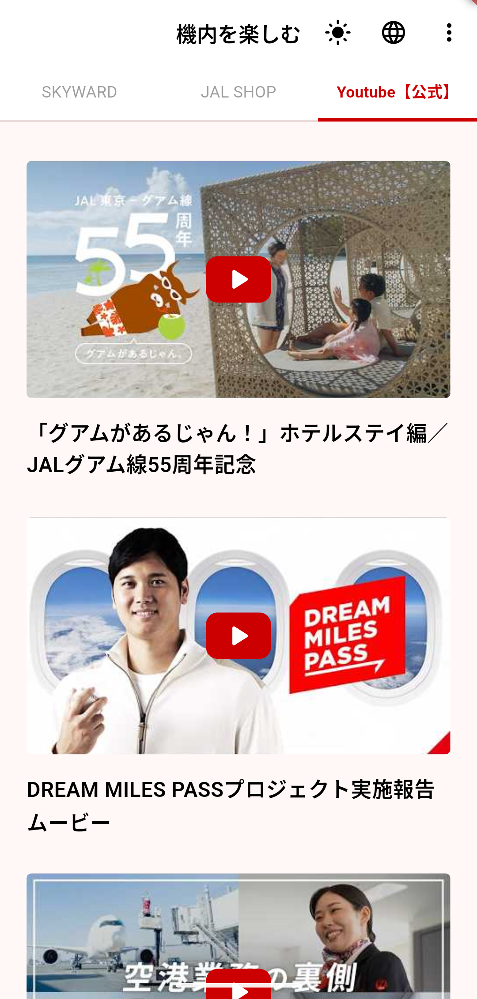
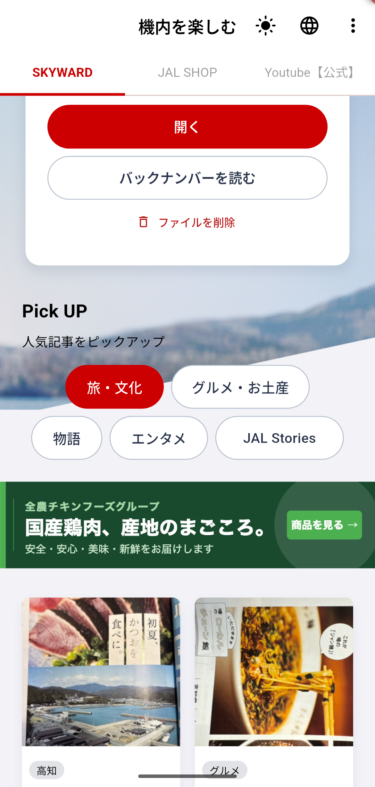
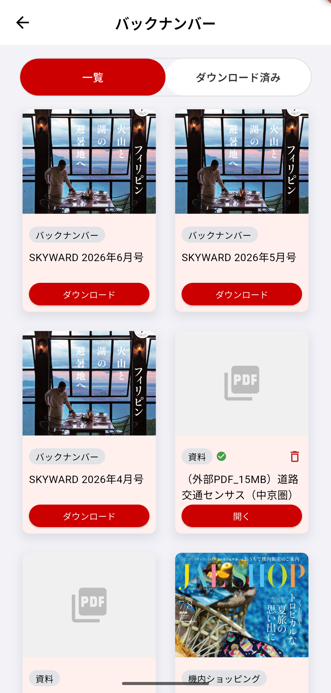
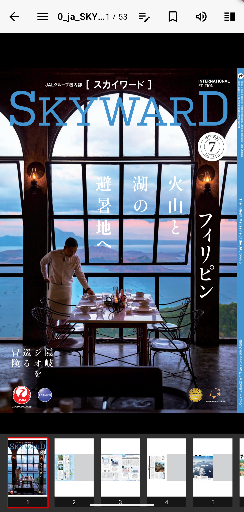
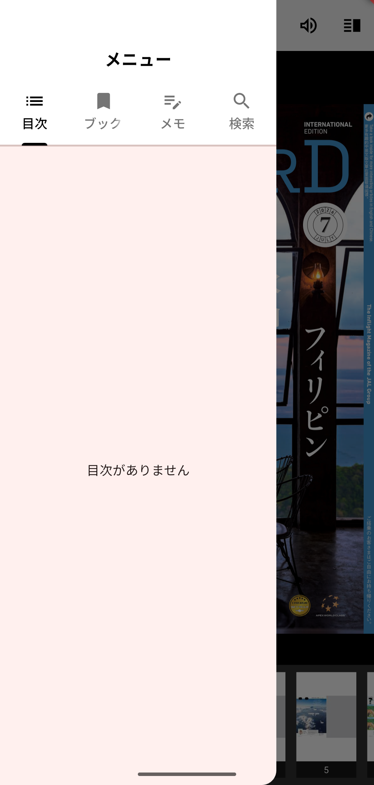
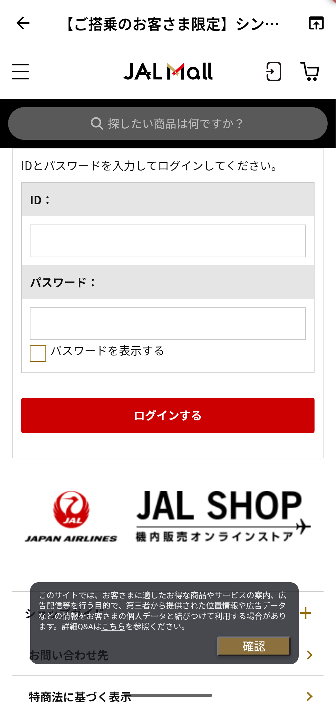

# 画面定義書

## 改訂履歴

| バージョン | 日付 | 変更内容 |
|---|---|---|
| 1.1 | 2026-07-28 | 各画面に実機スクリーンショットを追加（Android Pixel 7 デバッグビルドで取得） |
| 1.0 | 2026-07-28 | 初版作成 |

---

## 画面一覧

| 画面ID | 画面名 | ルート | 概要 |
|---|---|---|---|
| SCR-01 | コンテンツ一覧 | `/` | SKYWARD / JAL SHOP / YouTube の 3 タブ。起動時の初期画面 |
| SCR-02 | バックナンバー | `/backnumber` | 機内誌以外のコンテンツの一覧・ダウンロード済み絞り込み |
| SCR-03 | PDF ビューア | `/viewer` | PDF の閲覧・検索・ブックマーク・メモ・TTS |
| SCR-04 | WebView | `/webview` | 外部記事・ショップページのインアプリ表示 |

---

## SCR-01 コンテンツ一覧画面

### 概要

アプリ起動時に表示されるメイン画面。SKYWARD（機内誌）・JAL SHOP・YouTube の 3 タブで構成される。
SKYWARD タブは最新号フィーチャーカード・Pick UP 記事・カテゴリフィルター・バナー広告を含む。

### 画面キャプチャ

| SKYWARD タブ | JAL SHOP タブ |
|:---:|:---:|
|  |  |

| Youtube【公式】タブ | Pick UP セクション（スクロール後） |
|:---:|:---:|
|  |  |

### 画面遷移

| 遷移先 | 条件 |
|---|---|
| SCR-03 PDF ビューア | コンテンツをダウンロード済みで「開く」ボタンをタップ、またはダウンロード完了時に自動遷移 |
| SCR-02 バックナンバー | フィーチャーカードの「バックナンバーを読む」ボタンタップ |
| SCR-04 WebView | Pick UP 記事・バナー・JAL SHOP 商品タップ（showBackToList: Pick UP は true、その他は false） |
| ChromeSafariBrowser | YouTube 動画タップ（WebViewPage は使用せず ChromeSafariBrowser で開く） |

### レイアウト構成

Scaffold の AppBar に TabBar（3 タブ）を bottom として配置し、body に TabBarView を置く。  
SKYWARD タブの body は Stack 構造で、背景画像（diagonal_mask.png）の上に ListView を重ねる。

```
Scaffold
  AppBar
    title: "機内を楽しむ"
    actions: [テーマ切替, 言語切替, PopupMenu]
    bottom: TabBar [SKYWARD / JAL SHOP / Youtube【公式】]
  body: TabBarView
    Tab-0: SKYWARD（Stack: 背景画像 + ListView）
    Tab-1: JAL SHOP（ShopTab）
    Tab-2: Youtube【公式】（YoutubeTab）
```

---

### 表示要素

#### AppBar

| 要素 | 種別 | 内容・動作 |
|---|---|---|
| タイトル | Text | "機内を楽しむ"（ja） / "Enjoy In-Flight"（en）。centerTitle: true |
| テーマ切替ボタン | IconButton | 現在のモードに応じてアイコン変化（brightness_auto / light_mode / dark_mode）。タップ → テーマ切替ダイアログ |
| 言語切替ボタン | IconButton | `Icons.language`。タップ → 言語切替ダイアログ |
| その他メニュー | PopupMenuButton | `Icons.more_vert`。3 項目（後述） |

#### TabBar

| タブ | 表示名 | インデックス |
|---|---|---|
| Tab 0 | `SKYWARD` | 0 |
| Tab 1 | `JAL SHOP` | 1 |
| Tab 2 | `Youtube【公式】`（FittedBox でスケール） | 2 |

- indicatorColor: `#CC0000`、labelColor: `#CC0000`、labelStyle: bold 14px

---

#### SKYWARD タブ

**背景**

| 要素 | 値 |
|---|---|
| 背景色（ライト） | `#F2F2F7` |
| 背景色（ダーク） | `#121212` |
| 背景画像 | `assets/images/originals/diagonal_mask.png`、幅 390px、高さ 344px、タブ直下から配置 |

**フィーチャーカード（ContentFeaturedCard, inline モード）**

padding: `fromLTRB(24, 16, 24, 0)`。白カード（borderRadius 16、影あり）。

| 要素 | 値 |
|---|---|
| セクションヘッダー | "最新号を読む"（fontSize 18、w600） |
| 表紙画像 | `assets/images/originals/skyward_cover.png`、153×217px |
| ダウンロード中オーバーレイ | 半透明黒（alpha 0.55）+ CircularProgressIndicator + 進捗 % |
| タイトル | fontSize 18、fontWeight w300 |
| 主アクションボタン | 幅全体、高さ 48、赤背景（`#CC0000`）、StadiumBorder。ラベルは状態で変化（後述） |
| バックナンバーボタン | 白背景、枠線 `#B7C1CD`、幅全体、高さ 48。`/backnumber` に遷移 |
| 削除ボタン | ダウンロード済みのみ表示。error カラー（delete_outline アイコン） |

主アクションボタンのラベル：

| 状態 | ラベル |
|---|---|
| 公開期間外 | "閲覧不可"（無効） |
| 未ダウンロード | "最新号をダウンロード" |
| ダウンロード済み | "開く" |
| ダウンロード中 | LinearProgressIndicator + キャンセルボタン |

**Pick UP セクション**

padding: `only(left: 24)`

| 要素 | 値 |
|---|---|
| 見出し | "Pick UP"（fontSize 20、bold、black） |
| サブ | "人気記事をピックアップ"（fontSize 14、w300、black） |

**カテゴリフィルタータグ（2 行）**

各行は `FittedBox(fit: BoxFit.scaleDown)` でラップ。

| 行 | タグ | 幅 |
|---|---|---|
| 1 行目 | 旅・文化 | 108px |
| 1 行目 | グルメ・お土産 | 152px |
| 2 行目 | 物語 | 78px |
| 2 行目 | エンタメ | 108px |
| 2 行目 | JAL Stories | 141px |

タグスタイル：

| 状態 | 背景色 | 文字色 | 枠線 |
|---|---|---|---|
| 選択中 | `#CC0000` | 白 | `#CC0000` |
| 非選択 | 白 | `#2A344B` | `#B7C1CD` |

- 共通: height 48、borderRadius 24、アニメーション 150ms

**バナー広告**

| 要素 | 値 |
|---|---|
| 画像 | `assets/images/originals/banner_zennoh_chicken.png`、全幅 |
| タップ | `/webview`（`https://www.ja-zcf.co.jp/learned/all-japan/`、showBackToList: false） |

**コンテンツグリッド**

「旅・文化」タグ選択時は静的記事 6 件をハードコード表示。その他は `contentMasterProvider` から取得したコンテンツ（ContentPreviewCard）を表示。

| 設定 | 旅・文化 | その他 |
|---|---|---|
| カラム数 | 2 | 2 |
| crossAxisSpacing | 16 | 16 |
| mainAxisSpacing | 24 | 16 |
| childAspectRatio | 163/258 | —（mainAxisExtent 固定） |
| mainAxisExtent | — | 画面高 < 700 → 240、それ以外 → 260 |

静的記事（旅・文化）一覧：

| 画像アセット | タグ | タイトル | 遷移先 URL |
|---|---|---|---|
| kochi_katsuo.jpg | 高知 | 初夏、かつおを食べに | ontrip.jal.co.jp/chugoku-shikoku/17834167 |
| local_chain_ramen.jpg | グルメ | 噂のローカルチェーン飯 | ontrip.jal.co.jp/hokkaido/17777179 |
| sora_gourmet_aomori.jpg | 沖縄 | 食べたい！買いたい！空グルメ！ | ontrip.jal.co.jp/okinawa/17707921 |
| torimeshi_kagoshima.png | ad / 鹿児島 | 戦前から伝わる「高浜とりめし」… | ja-zcf.co.jp/learned/all-japan/828/ |
| pickup_carlease.jpg | カーリース | 【2026年6月最新】カーリースおすすめ12社… | skywardplus.jal.co.jp/plus_one/solution/car_lease/recommend/ |
| pickup_okamoto_sanbashi.jpg | 千葉 | 岡本桟橋（原岡桟橋）徹底ガイド… | skywardplus.jal.co.jp/hanto/plus_one/okamoto-sanbashi/ |

---

#### JAL SHOP タブ（ShopTab）

**切り替えタブ**（独自実装、高さ 48、borderRadius 24）

| タブ | ラベル | 商品数 |
|---|---|---|
| ご搭乗のお客様限定 | ご搭乗のお客様限定 | 4 件 |
| 商品一覧 | 商品一覧 | 4 件 |

**セクションヘッダー**

- タブ名（fontSize 18、w600）
- お気に入りボタン（OutlinedButton.icon、heart_border、枠線 `#B7C1CD`）

**商品グリッド**

SliverGrid（crossAxisCount: 2、crossAxisSpacing: 16、childAspectRatio: 163/309）

_ShopProductCard の構成：

| 要素 | 値 |
|---|---|
| 商品画像 | AspectRatio 1:1、ClipRRect（borderRadius 4） |
| 商品名 | fontSize 14、w600、最大 2 行 |
| 星評価 | rating > 0 のときのみ表示（赤 `#CC0000`） |
| 価格 | "○○円（税込）"（fontSize 14、w600） |
| タップ | `/webview`（showBackToList: false） |

---

#### YouTube タブ（YoutubeTab）

ListView（padding: top 34、left/right 23、bottom 24、separatorHeight 25）

_YoutubeVideoCard の構成：

| 要素 | 値 |
|---|---|
| サムネイル | AspectRatio 343/192（16:9）。YouTube thumbnail API から取得 |
| 再生ボタン | 中央、56×40、赤背景（`#CC0000`）、borderRadius 10 |
| 動画時間 | duration が空でないときのみ右下に表示 |
| タイトル | fontSize 18、w600、最大 2 行 |
| 視聴回数 | views が空でないときのみ表示（fontSize 13、`#666666`） |
| タップ | ChromeSafariBrowser（Full Screen）で YouTube を開く |

---

### ダイアログ・メニュー

#### PopupMenuButton（⋮ メニュー）

| 項目 | アイコン | 動作 |
|---|---|---|
| 通知テスト | `Icons.notifications` | 通知テストダイアログを表示 |
| ストレージ設定 | `Icons.storage` | ストレージ設定ダイアログを表示 |
| ストレージを初期化 | `Icons.delete_sweep`（赤） | 確認ダイアログ → PDF 削除 + SharedPreferences クリア |

#### テーマ切替ダイアログ

AlertDialog。タイトル: テーマアイコン + "テーマ"

| 選択肢 | アイコン |
|---|---|
| システム設定 | `Icons.brightness_auto` |
| ライト | `Icons.light_mode` |
| ダーク | `Icons.dark_mode` |

選択中の項目に `Icons.check_circle`（primaryColor）を表示。タップで即時切替。

#### 言語切替ダイアログ

AlertDialog。タイトル: language アイコン + "言語"

| 選択肢 | 旗 |
|---|---|
| 日本語 | 🇯🇵 |
| English | 🇺🇸 |

選択中の項目に `Icons.check_circle`。タップで即時切替。

#### 通知テストダイアログ

AlertDialog。タイトル: `Icons.notifications_active` + "通知テスト"

スケジュール中の場合: blue 背景（alpha 0.1）コンテナでスケジュール時刻を表示。

| 要素 | 種別 | 動作 |
|---|---|---|
| 今すぐ送信 | ElevatedButton.icon（send） | 即時通知を発行 |
| 時刻を指定してスケジュール | ElevatedButton.icon（schedule） | TimePicker → 指定時刻に通知をスケジュール |
| スケジュール済み通知をキャンセル | TextButton（赤） | NotificationService.cancelAll() |
| 閉じる | TextButton | ダイアログを閉じる |

#### ストレージ上限超過ダイアログ

AlertDialog。タイトル: `Icons.warning_amber_rounded`（orange）+ "保存容量の上限に達しました"

- 使用量バー（_StorageUsageBar）
- "不要なPDFを削除するか、設定で上限を変更してください。"（fontSize 13）
- 閉じるボタン

#### ストレージ設定ダイアログ

AlertDialog（StatefulBuilder）。タイトル: `Icons.storage` + "ストレージ設定"

- 使用量バー（_StorageUsageBar）
- 保存上限ラジオボタン（RadioListTile）

| 選択肢 | 値 |
|---|---|
| 100 MB | 100 × 1024 × 1024 B |
| 200 MB | 200 × 1024 × 1024 B |
| 500 MB（デフォルト） | 500 × 1024 × 1024 B |
| 1 GB | 1024 × 1024 × 1024 B |
| 2 GB | 2048 × 1024 × 1024 B |

- キャンセル / 保存ボタン

#### _StorageUsageBar

使用量テキスト（左）/ 上限テキスト（右） + LinearProgressIndicator（minHeight 8）

| 割合 | バー色 |
|---|---|
| < 80% | primaryColor（#CC0000） |
| ≥ 80% | Colors.orange |
| ≥ 100% | Colors.red |

---

### 状態・条件分岐

| 状態 | 表示 |
|---|---|
| contentMasterProvider loading | `Center(CircularProgressIndicator())` |
| contentMasterProvider error | `Center(Text(loadError($err)))` |
| データ取得成功 | タブコンテンツを表示 |

アプリがバックグラウンドから復帰（AppLifecycleState.resumed）すると `contentMasterProvider.notifier.refresh()` と `StorageLimitService.syncWithDirectory()` を実行。

---

## SCR-02 バックナンバー画面

### 概要

機内誌（category が "機内誌" / "In-flight Magazine"）以外の全コンテンツをグリッド表示する。「ダウンロード済み」タブではローカルに存在するファイルのみ絞り込む。

### 画面キャプチャ



### 画面遷移

| 遷移先 | 条件 |
|---|---|
| SCR-03 PDF ビューア | ContentPreviewCard のダウンロード済みコンテンツをタップ |

### レイアウト構成

```
Scaffold（backgroundColor: ライト #F2F2F7 / ダーク #121212）
  AppBar
    title: "バックナンバー"
  body: Column
    切り替えタブ（独自実装）
    Expanded → _BacknumberGrid（GridView.builder）
```

---

### 表示要素

#### AppBar

| 要素 | 値 |
|---|---|
| タイトル | "バックナンバー" |
| centerTitle | true |
| 戻るボタン（自動） | ← |

#### 切り替えタブ（独自実装）

padding: `fromLTRB(24, 16, 24, 12)`、Container（height 48、borderRadius 24、枠線 `#E0E0E0`）

| タブ | ラベル | 表示内容 |
|---|---|---|
| 一覧 | "一覧" | 全バックナンバー |
| ダウンロード済み | "ダウンロード済み" | ローカルに PDF ファイルが存在するもの |

_TabButton スタイル：

| 状態 | 背景色 | 文字色 |
|---|---|---|
| 選択中 | `#CC0000` | 白 |
| 非選択 | 白 | `#333333` |

- fontSize 13、w600、borderRadius 23、FittedBox でスケール

#### コンテンツグリッド（_BacknumberGrid）

GridView.builder

| 設定 | 値 |
|---|---|
| カラム数 | 2 |
| crossAxisSpacing | 16 |
| mainAxisSpacing | 16 |
| mainAxisExtent | 画面高 < 700 → 240、それ以外 → 260 |
| padding | `fromLTRB(24, 0, 24, 24)` |
| 各アイテム | ContentPreviewCard |

---

### 状態・条件分岐

| 状態 | 表示 |
|---|---|
| contentMasterProvider loading | `Center(CircularProgressIndicator())` |
| contentMasterProvider error | `Center(Text("エラー: $err"))` |
| バックナンバー 0 件 | `Center(Text("コンテンツがありません"))` |
| ダウンロード済みタブ・ディレクトリ未取得 | `Center(CircularProgressIndicator())` |
| ダウンロード済みタブ・0 件 | `Center(Text("ダウンロード済みのコンテンツはありません", style: grey))` |

アプリ復帰時（resumed）に `contentMasterProvider.notifier.refresh()` と `reloadKey.value++` を実行。

---

## SCR-03 PDF ビューア画面

### 概要

PDF ファイルを全画面で表示する。横スワイプでページ切り替え、ピンチズーム、検索・ブックマーク・メモ・TTS（音声読み上げ）・見開き分割モードを持つ。

### 画面キャプチャ

| 通常表示 | サイドドロワー（メニュー） |
|:---:|:---:|
|  |  |

### 画面遷移

| 遷移先 | 条件 |
|---|---|
| SCR-01 コンテンツ一覧 | 戻るボタン（`context.pop()` または `/` へ） |
| SCR-04 WebView | PDF 内の外部 URL リンクをタップ |

### レイアウト構成

```
Scaffold（backgroundColor: Colors.black）
  drawer: PdfSideDrawer
  body: Stack
    ┣ PDF本体（SelectionArea + Builder + PageView + InteractiveViewer + PdfPageView）
    ┣ PdfMiniMap（右上、ズーム > 2x で表示）
    ┣ PdfTopBar（上部、AnimatedSlide で表示/非表示）
    ┣ PdfSearchNavBar（トップバー直下、検索ヒット時のみ）
    ┗ PdfThumbnailStrip（下部、AnimatedSlide で表示/非表示）
```

---

### 表示要素

#### PdfTopBar

高さ: kToolbarHeight（56px）。背景色: ライト白（alpha 0.97）/ ダーク `#1E1E1E`（alpha 0.97）。

| 要素 | 種別 | 条件 | 動作 |
|---|---|---|---|
| 戻るボタン | IconButton（arrow_back） | 常時 | `context.pop()` または `/` へ |
| メニューボタン | IconButton（menu） | 常時 | サイドドロワーを開く |
| タイトル | Text（Expanded、省略） | 常時 | ファイル名 |
| ページ数 | Text（"current / total"） | pageCount > 0 | 表示のみ |
| メモボタン | IconButton（edit_note） | pageCount > 0 | メモ編集ボトムシートを表示 |
| ブックマークボタン | IconButton（bookmark） | pageCount > 0 | ブックマーク切り替え |
| 読み上げボタン | IconButton | pageCount > 0 | TTS 開始/停止 |
| 見開き分割ボタン | IconButton（vertical_split） | pageCount > 0 かつ onSplitToggle != null | 分割モード切り替え |

メモボタンのアイコン：

| 状態 | アイコン | 色 |
|---|---|---|
| メモなし | edit_note_outlined | fgColor |
| メモあり | edit_note | Colors.lightBlue |

ブックマークボタンのアイコン：

| 状態 | アイコン | 色 |
|---|---|---|
| 未登録 | bookmark_border | fgColor |
| 登録済み | bookmark | Colors.amber |

読み上げボタン：

| TTS 状態 | アイコン | 色 |
|---|---|---|
| idle | volume_up_outlined | fgColor |
| loading | CircularProgressIndicator（size 20、strokeWidth 2） | fgColor |
| speaking | stop_circle_outlined | kPdfRedPrimary（`#CC0000`） |

見開き分割ボタン：

| 状態 | 色 |
|---|---|
| OFF | fgColor |
| ON | Colors.lightBlue |

UI の表示/非表示は AnimatedSlide（duration 250ms、easeInOut）でアニメーション。タップ（250ms 以内、移動 < 20px）で切り替え。

---

#### PDF 本体表示

SelectionArea でテキスト選択を可能にし、PageView.builder でページを横スワイプで切り替え、各ページを InteractiveViewer でピンチズームする。

| 設定 | 値 |
|---|---|
| PageView physics | ズーム中または 2 本指 → NeverScrollable、通常 → PageScrollPhysics |
| InteractiveViewer minScale | 0.3 |
| InteractiveViewer maxScale | 5.0 |
| PageView allowImplicitScrolling | true |
| 最大 DPI（通常モード） | 150 |
| 最大 DPI（見開き分割モード） | 96 |

ダークモード時: ページ画像に `kPdfInvertColorFilter` を適用して色反転（白→黒、黒→白）。

各ページ上に積み重ねるオーバーレイ（decorationBuilder 内の Stack）：

| レイヤー | ウィジェット | 表示条件 |
|---|---|---|
| 1 | 背景（白/黒） | 常時 |
| 2 | PDFページ画像（pageImage）または _PagePreview | 常時 |
| 3 | PdfSearchHighlightOverlay | searchMatches が空でないとき |
| 4 | PdfTtsHighlightOverlay | TTS ネイティブパスでハイライト範囲確定時 |
| 5 | OCR ハイライト（黄色 Container） | TTS OCR パスでブロック確定時 |
| 6 | PdfPageTextOverlay | 常時（テキスト選択用） |
| 7 | PdfLinkOverlay | 常時 |

_PagePreview（フル品質画像ロード前に表示）：

| 優先度 | 取得元 | 目安 |
|---|---|---|
| 1 | ディスクキャッシュ | < 100ms |
| 2 | ネイティブサムネイル API（iOS: PDFKit） | 瞬時（組み込みサムネイル） |
| 3 | pdfrx render（400px 幅） | 1〜3s |

---

#### PdfThumbnailStrip

画面下部に固定。高さ: `kPdfThumbnailHeight(100) + 32 = 132px`。背景: `Colors.grey[850]`。

| 要素 | 値 |
|---|---|
| スクロール方向 | 横 |
| cacheExtent | 200px（スクロール方向の事前レンダリング量） |
| サムネイル幅 | kPdfThumbnailWidth = 70px |
| 現在ページの枠 | 赤（`#CC0000`）、width 2 |
| ブックマークアイコン | `Icons.bookmark`（amber）、右上 |
| ページ番号 | 下部バー（black54）、fontSize 10 |
| 現在ページ番号色 | `Colors.red[200]`、bold |

_CachedThumbnail のレンダリング優先度：

| 優先度 | 取得元 |
|---|---|
| 1 | インメモリキャッシュ（即時） |
| 2 | ディスクキャッシュ（< 100ms） |
| 3 | ネイティブサムネイル API（iOS: PDFKit、@2x 140px でリクエスト） |
| 4 | pdfrx フォールバック（Android / ネイティブ失敗時）。document が渡されている場合のみ |

同時レンダリング上限: 2（セマフォ制御）。

---

#### PdfMiniMap

| 要素 | 値 |
|---|---|
| 表示位置 | トップバー直下、右端（right 16、top: safeArea + kToolbarHeight + 8） |
| 表示条件 | TransformationController のスケールが 2.0 超のとき |
| 幅 | 70px |
| 内容 | PdfPageView（現在ページのサムネイル） + 現在表示領域の赤枠オーバーレイ |
| 赤枠描画 | CustomPaint（_MiniMapPainter）。TransformationController を repaint に渡す |

---

#### PdfSearchNavBar

トップバー直下に表示。`searchMatches` が空でない場合のみ表示。

背景: `#1565C0`（alpha 0.93）

| 要素 | 種別 | 内容 |
|---|---|---|
| 閉じるボタン | IconButton（close、白） | 検索をクリア |
| キーワード | Text（省略） | `「{query}」` |
| ページ番号 | Text | `{currentPage} ページ` |
| 前へボタン | IconButton（chevron_left） | ヒット件数 > 1 のときのみ有効 |
| ヒット位置 | Text | `{currentIndex+1} / {totalCount}` |
| 次へボタン | IconButton（chevron_right） | ヒット件数 > 1 のときのみ有効 |

---

#### PdfSideDrawer

左側のドロワー。DrawerHeader に 4 タブの TabBar を配置。

**ドロワーヘッダー**

背景: ライト白 / ダーク `#1E1E1E`

| 要素 | 値 |
|---|---|
| ラベル | "メニュー"（fontSize 18、bold） |
| TabBar タブ | 目次（list）/ ブックマーク（bookmark）/ メモ（edit_note）/ 検索（search） |

**目次タブ**

PdfOutlineItem のリスト。階層ごとに 16px インデント。深さ 0 は bold。  
子ノードがある場合: expand_more / expand_less ボタンで展開/折りたたみ。  
空: "目次がありません"

**ブックマークタブ**

ページ番号昇順でリスト表示。

| 要素 | 値 |
|---|---|
| アイコン | `Icons.bookmark`（amber） |
| タイトル | `"{page} ページ"` |
| 削除ボタン | `Icons.delete_outline` |
| タップ | ドロワーを閉じて該当ページへジャンプ |

空: "ブックマークがありません"

**メモタブ**

ページ番号昇順でリスト表示。

| 要素 | 値 |
|---|---|
| アイコン | `Icons.edit_note`（lightBlue） |
| タイトル | `"{page} ページ"` |
| サブタイトル | メモ本文（最大 2 行、fontSize 12） |
| 削除ボタン | `Icons.delete_outline` |
| タップ | ドロワーを閉じて該当ページへジャンプ |

空: "メモがありません"

**検索タブ**

| 要素 | 値 |
|---|---|
| 入力フィールド | TextField（prefixIcon: search、ヒント: "キーワードを入力..."） |
| 検索中 | CircularProgressIndicator（suffixIcon） |
| テキストあり | clear ボタン（suffixIcon） |
| 検索中メッセージ | "検索中..."（Row: CircularProgressIndicator + Text） |
| 0 件メッセージ | "一致するページがありません"（赤、fontSize 13） |

Enter キーで検索実行。ヒットがあれば ドロワーを閉じて最初のヒットページへ自動遷移。

---

### ダイアログ

#### メモ編集（showModalBottomSheet）

isScrollControlled: true、borderRadius: vertical(top: 16)

| 要素 | 値 |
|---|---|
| タイトル | `"メモ — {page} ページ"`（fontSize 16、w600） |
| 入力欄 | TextField（maxLines 6、autofocus、OutlineInputBorder） |
| 削除ボタン | 既存メモのみ表示。TextButton（赤） |
| キャンセルボタン | TextButton |
| 保存ボタン | FilledButton |

---

### ジェスチャー

| ジェスチャー | 動作 |
|---|---|
| 1 本指タップ（250ms 以内、< 20px 移動） | UI（トップバー・サムネイル）の表示/非表示切り替え |
| ダブルタップ | 2x ズームイン / 1x ズームアウト（アニメーション 250ms、easeInOut） |
| ピンチ | ズーム（min 0.3、max 5.0） |
| 横スワイプ（非ズーム時） | ページ切り替え |
| ロングプレス | テキスト選択（PdfPageTextOverlay） |
| ズームアウト < 1x で指を離す | 1.0x にスナップアニメーション（280ms、easeOut） |

---

### 状態管理

| 状態変数 | 初期値 | 用途 |
|---|---|---|
| selectedFile | null | 現在開いている PDF ファイル |
| pageCount | 0 | 総ページ数 |
| currentPage | 1 | 現在ページ（1 始まり） |
| outline | [] | 目次ノードリスト |
| bookmarks | {} | ブックマーク済みページ番号セット |
| memos | {} | ページ番号 → メモテキスト マップ |
| isUiVisible | true | UI 表示フラグ |
| isSplitMode | false | 見開き分割モード |
| searchQuery | "" | 検索クエリ |
| searchMatches | [] | 検索ヒット一覧 |
| searchIndex | 0 | フォーカス中のヒット番号 |
| ttsStatus | idle | TTS 状態（idle / loading / speaking） |

---

## SCR-04 WebView 画面

### 概要

外部 URL をインアプリで表示する画面。Pick UP 記事からの遷移時は「一覧へ戻る」固定バーを表示する。

### 画面キャプチャ



### 画面遷移

| 遷移先 | 条件 |
|---|---|
| 前の画面 | 「一覧へ戻る」ボタンまたは OS 戻るジェスチャー |

### レイアウト構成

```
Scaffold（resizeToAvoidBottomInset: false）
  AppBar
    title: ページタイトル（or URL）
    bottom: LinearProgressIndicator（ロード中のみ）
    actions: ブラウザで開くボタン
  body: Stack
    ┣ InAppWebView
    ┗ AnimatedPositioned（一覧へ戻るバー、showBackToList=true のみ）
```

---

### 表示要素

#### AppBar

| 要素 | 種別 | 内容・動作 |
|---|---|---|
| タイトル | Text（overflow: ellipsis） | ページタイトル（ロード完了前は URL） |
| プログレスバー | LinearProgressIndicator（height 2） | ロード中のみ。背景色 `#AA0000`、バー色白 |
| ブラウザで開くボタン | IconButton（open_in_browser） | URL をスナックバーで表示（URLCopied メッセージ） |

#### InAppWebView

| 設定 | 値 |
|---|---|
| javaScriptEnabled | true |
| allowsInlineMediaPlayback | true |
| mediaPlaybackRequiresUserGesture | false |
| clearCache | false |
| shouldOverrideUrlLoading | http/https/about/javascript 以外のスキームはキャンセル |

#### 「一覧へ戻る」バー（showBackToList=true のみ）

AnimatedPositioned（duration 250ms、easeInOut）で下スクロール時に画面外へスライド。タップで再表示。

| 要素 | 値 |
|---|---|
| 高さ | 72 + SafeArea bottom |
| 背景 | 白、上枠 `#E0E0E0` |
| ボタン幅 | maxWidth 296、幅 double.infinity |
| ボタン高さ | 48px |
| ボタン背景 | `#CC0000` |
| ボタン文字 | "一覧へ戻る"（白、fontSize 15、w600）、StadiumBorder |
| タップ | `Navigator.of(context).pop()` |

#### スクロール連動

| 動作 | 条件 |
|---|---|
| バー非表示 | 下スクロール（delta > 0、閾値 5px） |
| バー再表示 | ページ内コンテンツをタップ（UserScript 経由で JS → Flutter ハンドラ呼び出し） |

---

### 状態管理

| 状態変数 | 初期値 | 用途 |
|---|---|---|
| _isLoading | true | ロード中フラグ（プログレスバー表示制御） |
| _title | "" | ページタイトル（onLoadStop で取得） |
| _progress | 0 | ロード進捗（0.0〜1.0） |
| _showBottomBar | true | 「一覧へ戻る」バーの表示フラグ |
| _lastScrollY | 0 | スクロール方向検知用の直前 Y 座標 |

---

## 共通仕様

### カラー定義

| 名称 | 値 | 用途 |
|---|---|---|
| ブランドカラー | `#CC0000` | ボタン背景・アクセント・ビューア赤枠 |
| ダーク背景 | `#121212` | ダークモード画面背景 |
| ダークカード | `#1C1C1E` | ダークモードカード背景 |
| ダーク AppBar | `#1E1E1E` | ダークモード AppBar 背景 |
| ライト背景 | `#F2F2F7` | ライトモード画面背景 |
| フィルタータグ枠 | `#B7C1CD` | カテゴリフィルタータグ非選択時 |
| フィルタータグ文字 | `#2A344B` | カテゴリフィルタータグ非選択時 |
| カテゴリバッジ | `#E1E3E6` | コンテンツカードのカテゴリバッジ |
| 検索ナビバー | `#1565C0`（alpha 0.93） | PdfSearchNavBar 背景 |
| WebView 進捗背景 | `#AA0000` | WebViewPage プログレスバー背景色 |

### テーマ

3 モード: **system**（端末設定追従）/ **light** / **dark**。SharedPreferences で永続化。

| 要素 | ライト | ダーク |
|---|---|---|
| AppBar 背景 | 白 | `#1E1E1E` |
| AppBar 文字・アイコン | 黒 | 白 |
| ElevatedButton 背景 | `#CC0000` | `#CC0000` |
| ElevatedButton 文字 | 白 | 白 |
| FAB 背景 | `#CC0000` | `#CC0000` |
| CircularProgressIndicator | `#CC0000` | `#CC0000` |
| TabBar インジケーター | 黒 | 白 |
| TabBar 選択ラベル | 黒 | 白 |
| TabBar 非選択ラベル | black54 | white60 |

### 多言語対応

| 言語 | コード |
|---|---|
| 日本語 | `ja` |
| 英語 | `en` |

- 切替: コンテンツ一覧 AppBar の言語ボタン → 言語切替ダイアログ → `localeProvider.notifier.setLocale()`
- 永続化: SharedPreferences に言語コードを保存し、次回起動時に復元

### ナビゲーション（go_router）

| ルート | extra の型 | 画面 |
|---|---|---|
| `/` | なし | ContentListPage |
| `/backnumber` | なし | BacknumberPage |
| `/viewer` | `ViewerArgs`（または後方互換で `String`） | PdfViewerPage |
| `/webview` | `({String url, bool showBackToList})`（または `String`） | WebViewPage |

**ViewerArgs のフィールド：**

| フィールド | 型 | 説明 |
|---|---|---|
| filePath | String | ローカル PDF ファイルのパス |
| preventCapture | bool | true のとき OS レベルでスクリーンショット・録画を抑止 |

**遷移パターン：**

| 遷移 | メソッド | 備考 |
|---|---|---|
| コンテンツ一覧 → ビューア | `context.go('/viewer', ...)` | 履歴をクリアして遷移 |
| コンテンツ一覧 → WebView | `context.push('/webview', ...)` | 履歴に積む |
| PDF 内リンク → WebView | `Navigator.push(MaterialPageRoute)` | go_router を介さず直接遷移 |
| ビューア → 一覧 | `context.pop()` or `context.go('/')` | pop できない場合は go |
